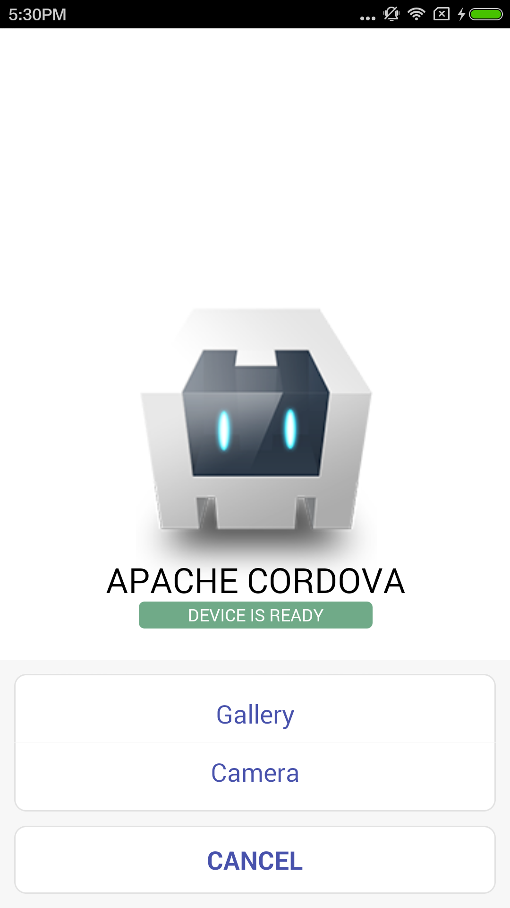
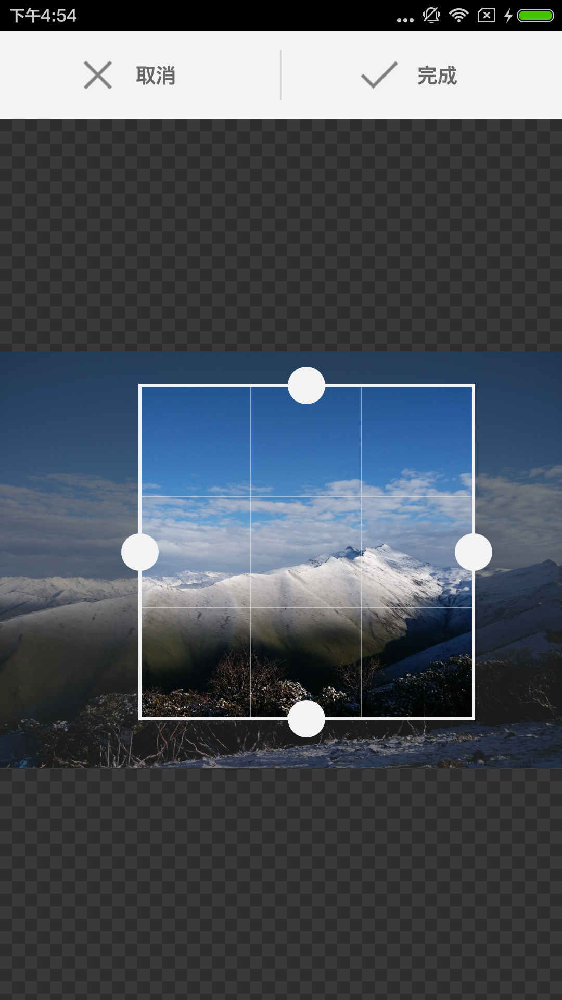

# cordova-plugin-pick-crop
  This is a cordova plugin for pick and crop photo.
  Just support android and ios.
  
  
#Install
    cordova plugin add https://github.com/huangliop/cordova-plugin-pick-crop.git
#Screen Shoot
    
#Usage

##Just pick a photo
```
 /**
     * just pick a image ,dont crop it
     * @param {[[Type]]} height  [[set the result image's height]]
     * @param {[[Type]]} success [[success callback function]]
     * @param {[[Type]]} error   [[error callback function]]
     */
plugins.pickCrop.pick(300,function(result){
    //"result" is base64 string of result photo
},function(error){
    console.error(error);
})   
```
##Pick and Crop a photo
```
 /** 
     * @param {[[Type]]} height  [[set the result image's height]]
     * @param {[[Type]]} success [[success callback function]]
     * @param {[[Type]]} error   [[error callback function]]
     */
plugins.pickCrop.crop(300,function(result){
    //"result" is base64 string of result photo
},function(error){
    console.error(error);
})   
```
#License
This android is based on [android-crop](https://github.com/jdamcd/android-crop)
